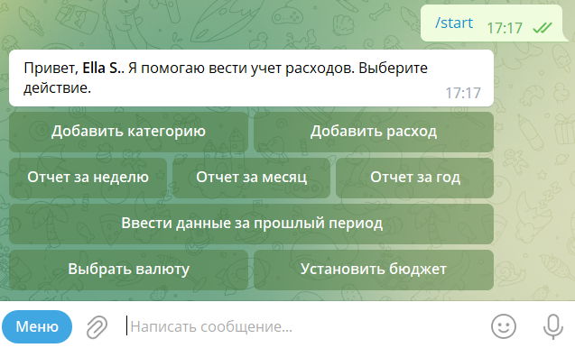
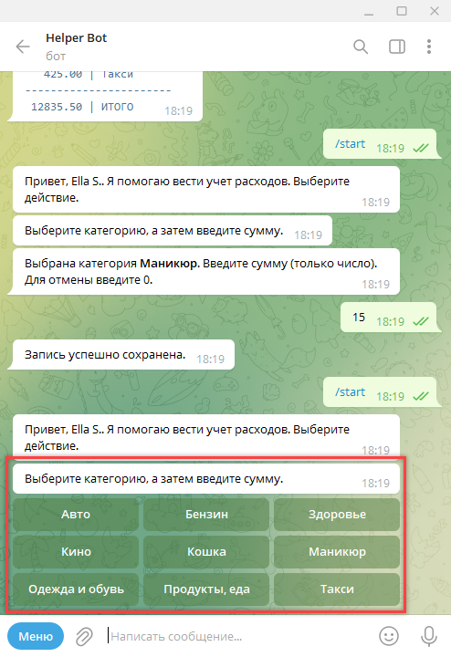
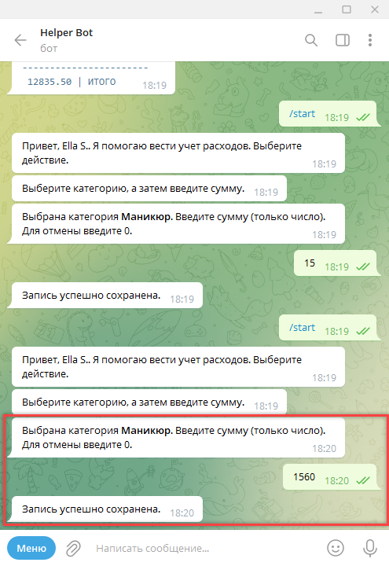
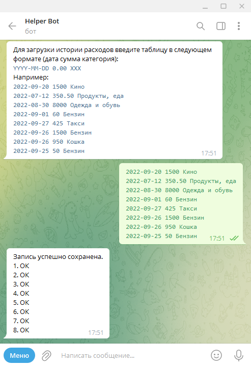
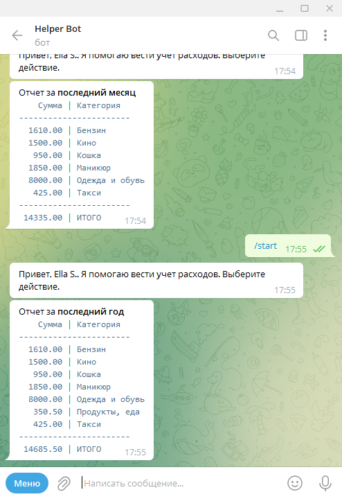
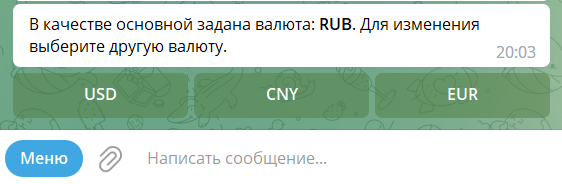
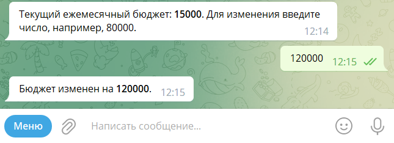

# Телеграм бот на GO (Golang)

Это учебный проект, демонстрирующий работу с телеграм ботом и др. на примере учета расходов пользователя по категориям.

В данном проекте:
1. получение и отправка сообщений пользователю через телеграм бот (используется библиотека [go-telegram-bot-api](https://github.com/go-telegram-bot-api/telegram-bot-api)),
2. пример загрузки конфигурационного файла приложения,
3. работа с PostgreSQL,
4. взаимодействие с внешним API (скачивание курсов валют из открытого источника),
5. работа с горутинами (периодическое обновление курсов валют),
6. примеры юнит и мок тестов,
7. вывод логов (zap),
8. пример middleware-функций для трейсинга и метрик,
9. пример compose для работы с докер-контенерами (postgres, prometheus, grafana, jaeger, kafka, zookeeper),
10. пример реализации LRU кэширования,
11. взаимодействие с брокером сообщений Кафка (Kafka),
12. отправка/получение прото-файлов по gRPC между сервисами,
13. отдельный сервис для получения сообщений из кафки и отправки данных по gRPC,
14. пример функции-дженерика (см. пакет net_http)

## Описание интерфейса работы с ботом в телеграме

Для начала работы необходимо ввети команду `/start`. Будет отображено основное меню:



### Ввод суммы расхода по категории

Для ввода суммы расхода, необхоходимо нажать кнопку `Добавить расход` и в появившемся списке категорий выбрать ту, по которой был совершен расход:



После выбора категории необходимо ввести сумму расхода (допускается ввод с копейками, например, 150.5):



Будет сохранен расход текущей датой.

Для добавления категории необходимо в основном меню нажать кнопку `Добавить категорию` и ввести название новой категории.

### Загрузка истории данных

Для загрузки истории расходов введите таблицу в следующем формате (дата сумма категория):
`YYYY-MM-DD 0.00 XXX`, например:

```
2022-09-20 1500 Кино
2022-07-12 350.50 Продукты, еда
2022-08-30 8000 Одежда и обувь
2022-09-01 60 Бензин
2022-09-27 425 Такси
```



### Вывод отчета

Для вывода отчета необходимо в основном меню нажать соответствующие кнопки: `Отчет за день`, `Отчет за месяц` или `Отчет за год`. Будет выведена таблица с отчетом по категориям за выбранный период:



### Изменение валюты

Для смены основной валюты для ввода расходов и отображения отчетов нажмите кнопку "Выбрать валюту" в основном меню, а затем кнопку с выбранной валютой.



### Установка лимита расходов на месяц

Для установки ежемесячного лимита расходов необхоходимо нажать кнопку `Установить бюджет` в основном меню ввести максимальную сумму бюджета (например, 150000):



При установке бюджета все вводимые расходы, превышающие бюджет, будут отклонены.
